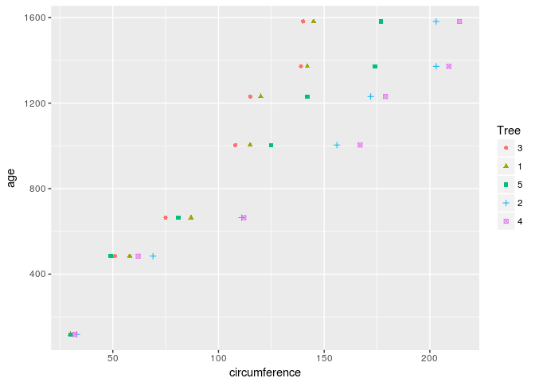
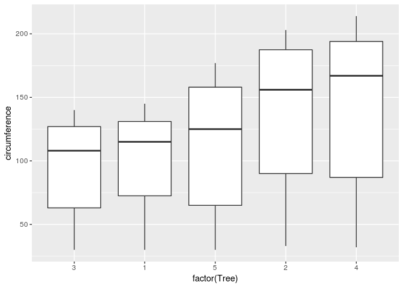
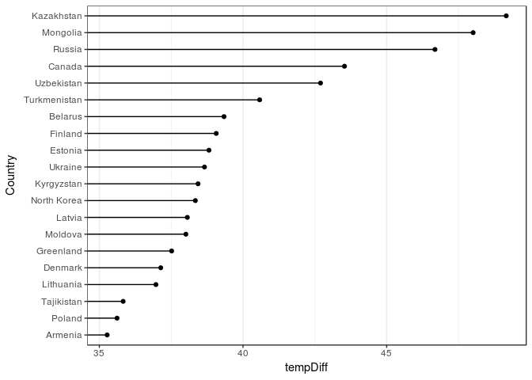
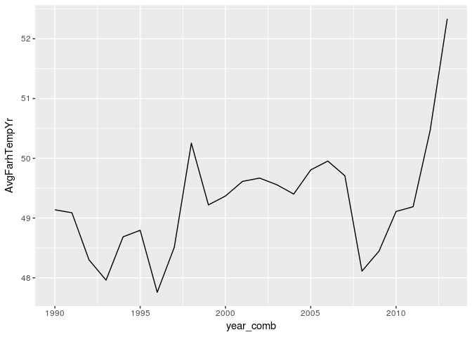
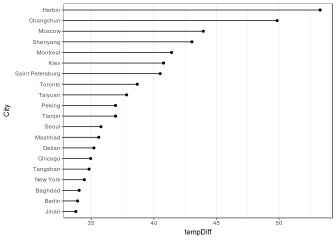

# Case Study 2
Group from MSDS 6306 - 404: Jethin Abraham, Daniel Higdon, Mustafa Sakarwala and Keyue Wang  
04/22/2017  


# Introduction
The puropose of our case study is twofold. In part 1 (Question 2 of the assignment), we will utilize R's built-in data set called Orange to calculate and plot our analysis of the trees. For part 2 (Question 3 of the assignment), we will analyze and compare temperatures in the United States and all major cities in the world. 

The project will take readers through the analysis step-by-step, from setup of the project to the final analysis. We will conclude with our findings of the analysis.

Before getting started, you should make sure you have installed and loaded the ggplot2, doBy, plyr, dplyr, and lubridate packages into your R workspace. We will use functions from these packages throughout the project. Also, be sure to set your working directory.


```r
if (!require("doBy")) {
  install.packages("doBy", repos="http://cran.rstudio.com/") 
}
```

```
## Loading required package: doBy
```

```
## Loading required package: methods
```

```r
library(doBy)
if (!require("ggplot2")) {
  install.packages("ggplot2", repos="http://cran.rstudio.com/") 
}
```

```
## Loading required package: ggplot2
```

```r
library(ggplot2)

if (!require("plyr")) {
  install.packages("plyr", repos="http://cran.rstudio.com/") 
}
```

```
## Loading required package: plyr
```

```r
library(plyr)

if (!require("dplyr")) {
  install.packages("dplyr", repos="http://cran.rstudio.com/") 
}
```

```
## Loading required package: dplyr
```

```
## 
## Attaching package: 'dplyr'
```

```
## The following objects are masked from 'package:plyr':
## 
##     arrange, count, desc, failwith, id, mutate, rename, summarise,
##     summarize
```

```
## The following objects are masked from 'package:stats':
## 
##     filter, lag
```

```
## The following objects are masked from 'package:base':
## 
##     intersect, setdiff, setequal, union
```

```r
library(dplyr)

if (!require("lubridate")) {
  install.packages("lubridate", repos="http://cran.rstudio.com/") 
}
```

```
## Loading required package: lubridate
```

```
## 
## Attaching package: 'lubridate'
```

```
## The following object is masked from 'package:plyr':
## 
##     here
```

```
## The following object is masked from 'package:base':
## 
##     date
```

```r
library(lubridate)
```

# Question 2 - Orange

## Step 1: Calculating the Mean and Median
We will be leveraging the doBy package to simplify our calculations of the mean and median of the trunk circumferences for different sizes of trees

```r
#Mean and median of the trunk circumference for different size of the trees.
summaryBy(circumference~Tree,data = Orange,FUN = list(mean,median))
```

```
##   Tree circumference.mean circumference.median
## 1    3           94.00000                  108
## 2    1           99.57143                  115
## 3    5          111.14286                  125
## 4    2          135.28571                  156
## 5    4          139.28571                  167
```

Here we see that Tree 1 has a circumference mean of 99.57 and circumference median of 115. Tree 2 has a circumference mean of 135.28 and circumference median of 156. Tree 3 has a circumference mean of 94.00 and circumference median of 108. Tree 4 has a circumference mean of 139.29 and circumference median of 167. Tree 5 has a circumference mean of 111.14 and circumference median of 125.

## Step 2: Generate a Scatter Plot 
After calculating the mean and median of the tree circumferences, we will use the ggplot2 package to create a scatter plot of the trunk circumferences against the age of the tree. We chose to plot circumference on the x-axis and age on the y-axis because age is the response variable in this case. Additionally, We will use different plotting symbols to represent each tree. 

```r
#Scatter plot of circumference vs. age
ggplot(Orange,aes(x=circumference,y=age,color=Tree,shape=Tree))+geom_point()
```

<!-- -->

## Step 3: Display a Box Plot
Lastly, we will display the trunk circumferences on a comparative boxplot against Tree. We will order the boxplots in the increasing order of maximum diameter.(Note: Here we are assuming that the order of the boxplots should be in ascending order according to the tree's maximum diameter) In order to do this, we must create a new column for maximum diameter. To calculate maximum diameter, we divide the tree's circumference by pi. 

```r
#adding diameter to the dataset
Orange$diameter<-Orange$circumference/pi
maxTree1<-max(subset(Orange,Tree==1)$diameter,na.rm=TRUE)
maxTree2<-max(subset(Orange,Tree==2)$diameter,na.rm=TRUE)
maxTree3<-max(subset(Orange,Tree==3)$diameter,na.rm=TRUE)
maxTree4<-max(subset(Orange,Tree==4)$diameter,na.rm=TRUE)
maxTree5<-max(subset(Orange,Tree==5)$diameter,na.rm=TRUE)

TreeDiam<-c(maxTree1,maxTree2,maxTree3,maxTree4,maxTree5)
DiamRank<-rank(TreeDiam)
TreeSize<-c(1,2,3,4,5)
Treediam_df<-data.frame(TreeDiam,DiamRank,TreeSize)
Orange_rank<-merge(Orange,Treediam_df,by.x="Tree",by.y="TreeSize")
Orange_rank<-Orange_rank[order(Orange_rank$DiamRank),]
#Circumference boxplots by Tree
ggplot(Orange_rank,aes(x=factor(Tree),y=circumference))+geom_boxplot()
```

<!-- -->

# Question 3 - Temp

## Step 1: Clean up the Temp Data (part i)
Before we perform our analysis, we will clean up the TEMP.csv data. We do this by defining YYYY-MM-DD as YMD and MM/DD/YY as MDY because there are 2 sets of dates in the sheet and we can only apply date formatting to 1 format. Next, we extract the years from each set and substitute NA with 0. Then, we combine the two sets based on the year variable and create a subset of that data where years greater than 1900*. Finally, we rename the columns appropriately and remove all NA records.  

*Note: Combining year1 and year2 will give us a single column of the year of the date. However, we see that dates with years greater than 1900 are all formatted the same way. Therefore, this step could have potentially been removed

```r
# Raw Data
raw <- read.csv('../data/TEMP.csv')

# There are 2 sets of dates in the sheet YYYY-MM-DD and MM/DD/YYYY. Applying any date 
#formating can be applied to only 1 format

# Defining YMD for YYYY-MM-DD format
raw$date1 <-ymd(raw$Date)
```

```
## Warning: 328503 failed to parse.
```

```r
#Defining MDY for MM/DD/YY
raw$date2<-mdy(raw$Date)
```

```
## Warning: 245720 failed to parse.
```

```r
#Extracting the year from the first set
raw$year1 <-year(raw$date1)

#Extracting the year from the second set
raw$year2<- year(raw$date2)

#Substituting the NA with 0 for year1 dataset
raw$year2[is.na(raw$year2)]<-0

#Substituting NA with 0 for year2
raw$year1[is.na(raw$year1)]<-0

#Combining the years for filtering the dataset
raw$year.combined <- raw$year1+raw$year2

#Filtered out the dataset
degree <- subset(raw,year.combined>1900)

#Renaming the columns
names(degree)<-c("Date","MoAvgTemp","MoAvgTemp_Unc","Country","date1","date2","year1","year2","year_comb")

#Remove "NA"records
degreeexNA<-subset(degree,MoAvgTemp!="NA")
```

## Step 2: Analyze and Visualize Temp Data (part i)
We begin our analysis by creating a dataset with the max and min temperatures for each country. We then combine the max and min temperatures to calculate the differences, and we rank the countries by decreasing order of max temperature difference. Lastly, we create a subset of only the top twenty countries based on maximum difference and plot the data using ggplot2.

```r
#Create a dataset with the max and min temps for each country
maxTemp<-ddply(degreeexNA,"Country", summarise,maxMoTemp=max(MoAvgTemp))
minTemp<-ddply(degreeexNA,"Country", summarise,minMoTemp=min(MoAvgTemp))

#Combine the max and min temps to calculate a difference
degree2<-merge(maxTemp,minTemp,by.x="Country",by.y="Country")
degree2$tempDiff<-degree2$maxMoTemp-degree2$minMoTemp

#Order and rank the countries in decreasing order of max temp diff
degree2_rank<-degree2[order(degree2$tempDiff,decreasing=TRUE),]

degree2_rank$tempRank<-seq(1,241,1)

#limit the data to only the top twenty
degree_topTwenty<-subset(degree2_rank,tempRank<21)

#Reorder the data on tempRank to make the graph prettier
Countryorder<-degree_topTwenty$Country[order(degree_topTwenty$tempRank,decreasing=TRUE)]
degree_topTwenty$Country<-factor(degree_topTwenty$Country,level=Countryorder)

#Graph the results
graphi <- ggplot(degree_topTwenty,aes(x=tempDiff,y=Country))+geom_segment(aes(yend=Country),xend=0)+geom_point()+theme_bw()+theme(panel.grid.major.y=element_blank())
graphi
```

<!-- -->

The top 20 countries with the maximum temperature differences for the period since 1900 are (in order) Kazakhstan, Mongolia, Russia, Canada, Uzbekistan, Turkmenistan, Belarus, Finland, Estonia, Ukraine, Kyrgezstan, North Korea, Latvia, Moldova, Greenland, Denmark, Lithuania, Tajikistan, Poland, and Armenia.


## Step 3: Analyze and Visualize subset UStemp (part ii)
UStemp is a subset of Temp data set that includes temperatures in the US since 1990. With UStemp, we will first create a new column to display the monthly average land temperature in Fahrenheit. Next, we will calculate and plot the average temperature by year. Finally, we will use a for loop to calculate the one year difference of average land temperature by year and provide the maximum difference of the corresponding two years. 

```r
#create US subset for only years >=1990
UStemp<-subset(degree,degree$Country=="United States" & degree$year_comb>=1990)

#add a Fahrenheit column
UStemp$fahr<-UStemp$MoAvgTemp*1.8+32
#avg temp by year with plot
UStemp_year<-ddply(UStemp,"year_comb", summarise,AvgFarhTempYr=mean(fahr))
ggplot(UStemp_year,aes(x=year_comb,y=AvgFarhTempYr))+geom_line()
```

<!-- -->

```r
#Number of records

t <-length(UStemp_year$AvgFarhTempYr)


#Question 3 c

#Defining the data frame to store the records
mat <- data.frame(24,24)

#Loop to do the difference of years
for ( i in 1:t){
  landtemp_diff <- round(UStemp_year[i+1,2]- UStemp_year[i,2],digits = 3)
  
  year_diff <- paste(cbind(as.character(UStemp_year[i+1,1]),as.character(UStemp_year[i,1])),collapse='-')
  
  mat[i,] <-  c(year_diff,landtemp_diff)
}

#Renaming the coloumns
names(mat) <- c('year_diff','temp_diff')

#Printing the results
mat
```

```
##    year_diff temp_diff
## 1  1991-1990     -0.05
## 2  1992-1991    -0.787
## 3  1993-1992     -0.34
## 4  1994-1993     0.726
## 5  1995-1994     0.109
## 6  1996-1995    -1.038
## 7  1997-1996     0.753
## 8  1998-1997     1.743
## 9  1999-1998    -1.034
## 10 2000-1999     0.149
## 11 2001-2000     0.244
## 12 2002-2001     0.055
## 13 2003-2002     -0.11
## 14 2004-2003    -0.158
## 15 2005-2004     0.405
## 16 2006-2005     0.147
## 17 2007-2006    -0.247
## 18 2008-2007    -1.595
## 19 2009-2008     0.334
## 20 2010-2009     0.663
## 21 2011-2010      0.08
## 22 2012-2011      1.28
## 23 2013-2012     1.865
## 24   NA-2013      <NA>
```

```r
#Substituting NA with 0 for last record
mat$temp_diff[is.na(mat$temp_diff)] <-0

#Finding the max diff

max_diff <- subset(mat,mat$temp_diff ==max(mat$temp_diff))

max_diff
```

```
##    year_diff temp_diff
## 23 2013-2012     1.865
```

Here we see that the maximum temperature difference between 2 years since 1990 is 2012-2013 where the temperature difference is 1.86 degree Fahrenheit.

## Step 4: Clean up the CityTemp Data (part iii)
Before we perform our analysis, we will clean up the CITYTEMP.csv data. We do this by defining YYYY-MM-DD as YMD and MM/DD/YY as MDY because there are 2 sets of dates in the sheet and we can only apply date formatting to 1 format. Next, we extract the years from each set and substitute NA with 0. Then, we combine the two sets based on the year variable and create a subset of that data where years greater than 1900*. Finally, we rename the columns appropriately and remove all NA records.  

*Note: Combining year1 and year2 will give us a single column of the year of the date. However, we see that dates with years greater than 1900 are all formatted the same way. Therefore, this step could have potentially been removed

```r
# CityTemp Data
CityTemp <- read.csv('../data/CityTemp.csv')

# There are 2 sets of dates in the sheet YYYY-MM-DD and MM/DD/YYYY. Applying any date 
# formating can be applied to only 1 format

# Defining YMD for YYYY-MM-DD format
CityTemp$date1 <-ymd(CityTemp$Date)
```

```
## Warning: 135135 failed to parse.
```

```r
# Defining MDY for MM/DD/YY
CityTemp$date2<-mdy(CityTemp$Date)
```

```
## Warning: 102065 failed to parse.
```

```r
#Extracting the year from the first set
CityTemp$year1 <-year(CityTemp$date1)

#Extracting the year from the second set
CityTemp$year2<- year(CityTemp$date2)

#Substituting the NA with 0 for year1 dataset
CityTemp$year2[is.na(CityTemp$year2)]<-0

#Substituting NA with 0 for year2
CityTemp$year1[is.na(CityTemp$year1)]<-0

#Combining the years for filtering the dataset
CityTemp$year.combined <- CityTemp$year1+CityTemp$year2

#Filtered out the dataset
CityTemp1900 <- subset(CityTemp,year.combined>1900)

#Renaming the columns
names(CityTemp1900)<-c("Date","MoAvgTemp","MoAvgTemp_Unc","City","Country","Latitude","Longitude","date1","date2","year1","year2","year_comb")

#Remove "NA"records
CityTemp1900exNA<-subset(CityTemp1900,MoAvgTemp!="NA")
```

## Step 5: Analyze and Visualize CityTemp Data (part iii)
We begin our analysis by creating a dataset with the max and min temperatures for each major city. We then combine the max and min temperatures to calculate the differences, and we rank the cities by decreasing order of max temperature difference. Lastly, we create a subset of only the top twenty cities based on maximum difference and plot the data using ggplot2.

```r
#Create a dataset with the max and min temps for each City
maxTemp<-ddply(CityTemp1900exNA,"City", summarise,maxMoTemp=max(MoAvgTemp))
minTemp<-ddply(CityTemp1900exNA,"City", summarise,minMoTemp=min(MoAvgTemp))

#Combine the max and min temps to calculate a difference
CityTemp1900_2<-merge(maxTemp,minTemp,by.x="City",by.y="City")
CityTemp1900_2$tempDiff<-CityTemp1900_2$maxMoTemp-CityTemp1900_2$minMoTemp

#Order and rank the cities in decreasing order of max temp diff
CityTemp1900_rank<-CityTemp1900_2[order(CityTemp1900_2$tempDiff,decreasing=TRUE),]

CityTemp1900_rank$tempRank<-seq(1,99,1)

#limit the data to only the top twenty
CityTemp1900_top20<-subset(CityTemp1900_rank,tempRank<21)

#Reorder the data on tempRank to make the graph prettier
Cityorder<-CityTemp1900_top20$City[order(CityTemp1900_top20$tempRank,decreasing=TRUE)]
CityTemp1900_top20$City<-factor(CityTemp1900_top20$City,level=Cityorder)

#Graph the results
graphii <- ggplot(CityTemp1900_top20,aes(x=tempDiff,y=City))+geom_segment(aes(yend=City),xend=0)+geom_point()+theme_bw()+theme(panel.grid.major.y=element_blank())
graphii
```

<!-- -->

The top 20 major cities with the maximum temperature differences for the period since 1900 are (in order) Harbin, Changchun, Moscow, Shenyang, Montreal, Kiev, St Petersburg, Toronto, Taiyuan, Peking, Tianjin, Seoul, Mashhad, Dalian, Chicago, Tangshan, New York, Baghdad, Berlin, and Jinan.

## Step 6: Compare Temp plot and CityTemp plot
From our two plots below, we can see that there are some interesting correlations(or lack thereof). For example, 3 of the top 4 cities are in China(Harbin, Changchun, and Shenyang) but China is not included in the top 20 countries. Looking into the data more closely, we can see that countries and cities near the equator or North/South poles are typically not on the top 20 lists. This is because these locations are generally always hot or always cold with not much variation. Generally speaking, the top 20 lists consist of Cities and Countries that are somewhere in the middle of the equator and North/South poles. 

```r
#Plot the graph of the top 20 countries with the maximum temperature difference since 1900
graphi
```

<!-- -->

```r
#Plot the graph of the top 20 major cities with the maximum temperature difference since 1900
graphii
```

<!-- -->

# Conclusion
Since this Case Study was based on 2 different projects (Orange and Temp), we will break down the conclusions seperately

## Orange
In this project, we calculated the circumference mean and median, and generated two plots to show our analysis on R's built-in data set Orange. Our mean/median calculations show that Tree 3 has the smallest circumference mean and median while Tree 4 has the largest. From our scatterplot, we can conclude that trees 2 and 4 are consistently at the larger end of the circumference measurements throughout the tree's lifecycle. Conversely, trees 3 and 1 are on the smaller end. Tree 5 starts out as the smallest tree, but eventually outgrows trees 3 and 1. Lastly, our boxplot(which is ordered by increasing diameter) shows that trees 3 and 1 are generally smaller that trees 2 and 4, no matter which quantile we compare them at. There are also no outliers in any of the 5 trees.
  
## Temp
In this project, we analyzed and visualized three data sets: Temp, TempUS, and CityTemp. Before we were able to conduct our analysis, we made sure to clean up our data accordingly so that we can extract the year correctly from the formatted dates. 

From our Temp data analysis, we saw that the top 20 countries with the maximum differences for the period since 1900 are (in order) Kazakhstan, Mongolia, Russia, Canada, Uzbekistan, Turkmenistan, Belarus, Finland, Estonia, Ukraine, Kyrgezstan, North Korea, Latvia, Moldova, Greenland, Denmark, Lithuania, Tajikistan, Poland, and Armenia. 

Analyzing USTemp, a subset of Temp with only temperatures in the United States, we can see that the average yearly temperature in Fahrenheit has been increasing at a quicker rate since 2008. In fact, we concluded that the maximum temperature difference between 2 years since 1990 was in 2012-2013 where the temperature difference was 1.865 degree Fahrenheit.

The CityTemp data set was similar to the Temp dataset. The difference was that it included major cities and their latitude and longitude. Our analysis showed that the top 20 major cities with the maximum temperature differences for the period since 1900 are (in order) Harbin, Changchun, Moscow, Shenyang, Montreal, Kiev, St Petersburg, Toronto, Taiyuan, Peking, Tianjin, Seoul, Mashhad, Dalian, Chicago, Tangshan, New York, Baghdad, Berlin, and Jinan.


